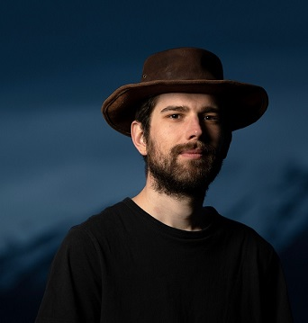

### Personal Information ###

| **Name**               | Rastislav Švihra
|                        | 
|                        |

### Education ###

| **University**         | 

|                        |
| September 2020         | Diploma (Mgr.) in **Digital and instrumental optics**, Palacký University in Olomouc, Czech republic
|                        |
| June 2018              | Diploma (Bc.) in **Digital and instrumental optics**, Palacký University in Olomouc, Czech republic
|                        |

| **High School**         | 
|                         |
| June 2015               | Matura (Final exam), Billingual grammar school, Liptovský Mikuláš, Slovakia
|                         |

### Work Experience ###

| 2023 - now     |**Optical Engineer**, Forvia Hella, Bánovce nad Bebravou, Slovakia

| 2020 - 2023    |**Optical Engineer**, Meopta Optika s.r.o., Přerov, Czech republic

| 2016 - 2019    |**Administrative assistant**, Transformátory, s.r.o., Liptovský Mikuláš, Slovakia

|     |

#### Seasonal Jobs

|2019 sum.  | allrounder at Hotel Tiefenbach, **Switzerland**

|2018 sum.  | allrounder at Berggasthaus Tannalp, **Switzerland**

|2017 sum.  | allrounder at Štefánikova chata pod Ďumbierom, **Slovakia**

|   |

### Computer Skills ###

|**Zemax OpticStudio**        | advanced
|                        |
|**Creo**                     |advanced
|                        |
|**Ansys Speos**              |advanced

|**Catia V5**                 |advanced

|**Autodesk Inventor**        |advanced

|**Matlab**                   |beginner

|**Python**                   |beginner

|**Git**                      |beginner

|**LaTex**                    |beginner

|**MS Office**                |intermediate

|   |



comment



### Language Skills

|**Slovak**    |mother language

|**Czech**     |expert

|**English**   |working profficiency

|**German**    |basic communication, learning

|**Russian**   |passive, basics, learning

|   |

